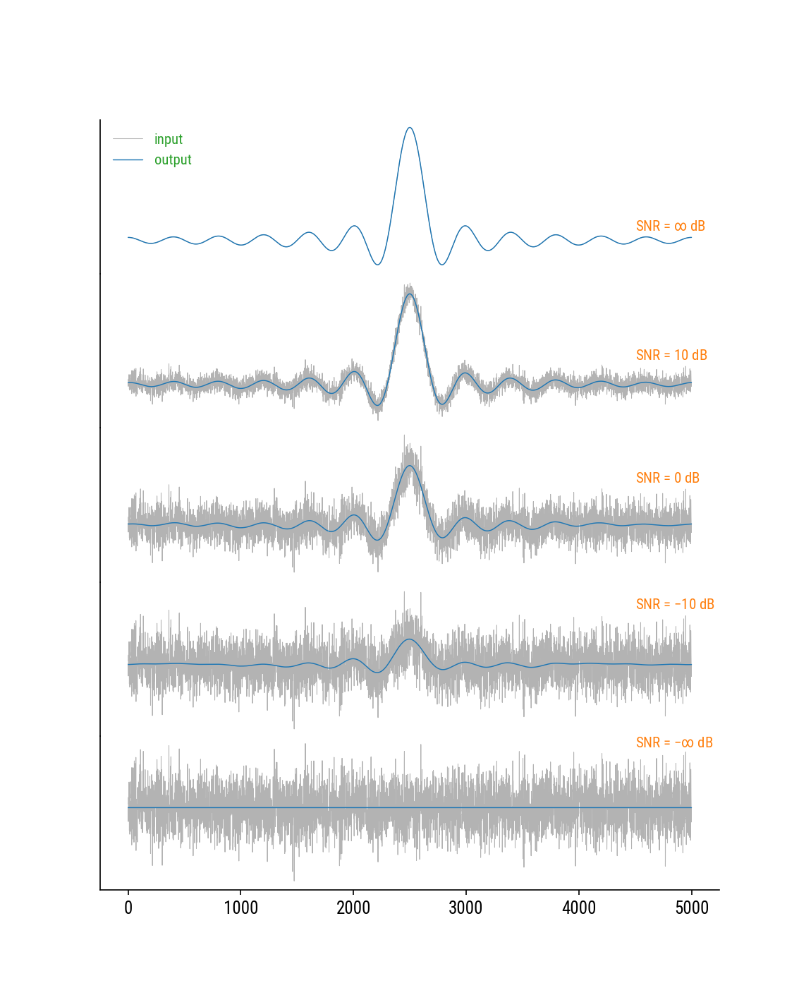

# 1D Spectra Denoise
The Denoising algorithm is essentially derived from **singular value decomposition** (**SVD**).
By first constructing a **partial circulant matrix** using the spectral data, the noise components are discriminated after SVD of the matrix.
A Smoother spectrum is reconstructed from a low-rank approximation of the matrix using only the signal components.

The code is completely written in `Python`, with numerical support by the standard packages `Scipy` and `Numpy`.
It works out of the box after the user has fed with an input.
It will autonomously output the optimal result.

## Prerequisites
 - `Python 3`
 - `Scipy`, `Numpy`
 - `Matplotlib` (_optional, only if visualization is needed_)

## Example
Imagine now a clean _sinc signal_ is corrupted by an _additive Gaussian white noise_, which results in a noisy _sequence_ of length `5000`.
To denoise the sequence, we just need two lines.

``` python
d = Denoise(sequence) # instantiate the class
denoised_sequence = d.denoise(1000) # 1000 defines the number of rows of the constructed matrix
```

The denoising capability at different _signal-to-noise ratios_ (SNRs) is demonstrated in the figure below. 
Note that when the noise is absent, the signal is perfectly restored.
When the signal is absent, the noise mean is returned, which agrees with one's intuition.



## License
This repository is licensed under the **GNU GPLv3**.
